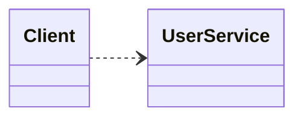
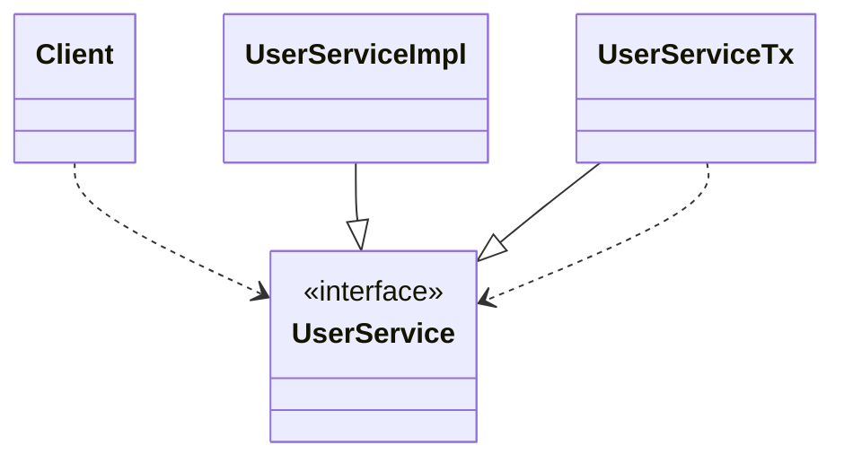
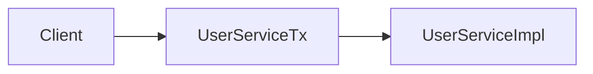
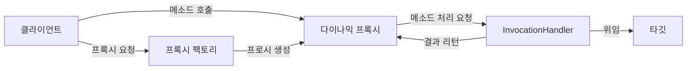
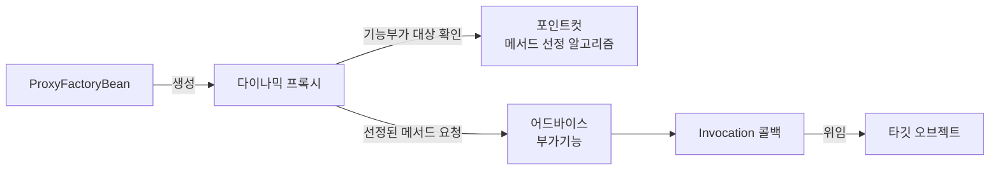

# 6장 AOP 요약

### DI 적용을 이용한 트랜잭션 분리

구현 클래스를 직접 참조하게 된다면 비즈니스 로직과 트랜잭션 경계설정 코드를 분리할 수 없음



인터페이스를 이용해 구현 클래스를 런타임시에 DI를 통해 적용하게 하여 트랜잭션 경계설정의 책임을 갖는 구현 클래스와 비즈니스 로직을 처리하는 구현 클래스를 별도로 분리



클라이언트의 사용자 관리 로직 이용 시도 (UserService) → 트랜잭션 관련 작업 진행 (UserServiceTx) → 비즈니스 로직 관련 작업 수행 (UserServiceImpl)



트랜잭션 경계설정 코드를 분리하고 DI를 통해 연결하므로써 비즈니스 로직 코드에 트랜잭션 관련 기술적인 내용이나 트랜잭션 적용 여부가 영향을 주지 않음

DI를 이용하여 트랜잭션 기능을 가진 오브젝트만 먼저 실행하면되므로 언제든지 트랜잭션 도입 가능

비즈니스 로직 관련 테스트가 용이

### 프록시(proxy)

단순히 확장성을 고려하여 부가기능을 위임하여 핵심기능과 구체적인 부가기능 구현 코드를 분리하는 전략 패턴과는 다르게, 트랜잭션 관련 코드를 분리할 때처럼 부가기능 전부를 핵심기능 코드가 담긴 클래스에서 독립시켜 클라이언트가 사용하려는 실제 대상인 것처럼 위장하여 클라이언트의 요청을 받아 처리하는 것

- 실제 대상인 것처럼 위장하여 클라이언트의 요청을 받고 부가기능 수행하는 오브젝트
- 타깃과 같은 인터페이스를 구현, 타깃을 제어할 수 있는 위치
- 클라이언트가 타깃에 접근하는 방법을 제어 / 타깃에 부가적인 기능을 부여

타깃(target) / 실체(real subject) : 프록시를 통해 최종적으로 요청을 위임받아 처리하는 오브젝트

### 데코레이터 패턴

타깃에 부가적인 기능을 런타임 시 다이나믹하게 부여해주기 위해 프록시를 사용하는 패턴

코드상에서는 어떤 방법과 순서로 프록시와 타깃이 연결되어 사용되는지 정해져 있지 않음

예시) FileInputStream에 버퍼 읽기 기능 제공을 위한 BufferedInputStream 데코레이터 적용, 트랜잭션 처리를 위해 UserServiceTx 클래스로 선언된 userService 빈 데코레이터 적용

### 프록시 패턴

프록시를 통해 클라이언트가 타깃에 접근하려는 방식을 변경

클라이언트에게 타깃에 대한 레퍼런스를 넘길 때 실제 타깃 오브젝트를 생성하는 대신 프록시를 넘긴 뒤, 클라이언트가 프록시의 메서드를 호출할 때 타깃을 생성하여 요청을 위임하는 방식

데코레이터와 다르게 타깃 오브젝트의 구체적인 생성 방법을 알아야 하기에 코드에서 접근할 타깃 클래스의 정보를 알고 있는 경우가 많음

예시) RMI, EJB 등의 리모트 기술을 이용하여 다른 서버의 원격 오브젝트를 이용할 때 해당 오브젝트에 대한 프록시를 만들어 두어 로컬에 존재하는 오브젝트를 사용하는 것처럼 프록시를 사용

특정 레이어에서 타깃에 대한 접근권한을 제어할 때  사용

### 다이나믹 프록시

프록시 클래스의 정의 없이 몇가지 API로 프록시처럼 동작하는 오브젝트를 다이나믹하게 생성하는 것

자바의 코드 자체를 추상화해서 접근가능하도록 하는 리플렉션 기능을 이용하여 프록시를 생성

- java.lang.reflect.Method 인터페이스의 invoke() 메서드 : 메서드를 실행시킬 대상 오브젝트(obj)와 파라미터 목록(args)을 받아 메서드를 호출 한뒤, 결과를 Object 타입으로 리턴
- 다이나믹 프록시 오브젝트는 클라이언트의 모든 요청을 리플렉션 정보로 변환하여 InvocationHandler 구현 오브젝트의 invoke() 메서드로 넘김



프록시 생성

1. 다이나믹 프록시가 정의되는 클래스 로더 제공
2. 다이나믹 프록시가 구현해야 할 인터페이스 배열 지정
3. 부가기능과 위임 관련 코드를 가진 InvocationHandler 구현 오브젝트 제공

```java
User proxiedUser = (User)Proxy.newProxyInstance(
			getClass().getClassLoader(),    // 다이나믹 프록시 클래스 로더
			new Class[] { User.class },     // 구현할 인터페이스
			new UserInvocationHandler(new UserTarget())); // InvocationHandler
```

트랜잭션 invocationHandler

```java
public class TransactionHandler implements InvocationHandler {
	private Object target;
	private PlatformTransactionManager transactionManager;
	private String pattern;
	
	public void setTarget(Object target){
		this.target = target;
	}
	
	public void setTransactionManager(PlatformTransactionManager transactionManager) {
		this.transactionManager = transactionManager;
	}

	public void setPattern(String pattern) {
		this.pattern = pattern;
	}

	public Object invoke(Object proxy, Method method, Object[] args) throws Throwable {
		// 트랜잭션 적용대상 메서드 선별하여 트랜잭션 경계설정 기능 부여
		if(method.getName().startsWith(pattern)){
			return invokeInTransaction(method, args);
		} else {
			return method.invoke(target, args);
		}
	}

	private Object invokeInTransaction(Method method, Object[] args) throws Throwable {
		TransactionStatus status = this.transactionManager.getTransaction(new DefaultTransactionDefinition());
		try {
			// 타깃 오브젝트 메서드 호출, 예외 미발생시 커밋
			Object ret = method.invoke(target, args);
			this.transactionManager.commit(status);
			return ret;
		} catch (InvocationTargetException e){
			// 예외 발생시 트랜잭션 롤백
			this.transactionManager.rollback(status);
			throw e.getTargetException();
		}
	}
```

### 팩토리 빈(FactoryBean)

스프링을 대신해서 오브젝트의 생성로직을 담당하도록 만들어진 빈

다이나믹 프록시는 사전에 클래스 이름을 알 수 없기 때문에 스프링 빈으로 등록하여 사용할 수 없음

팩토리 빈은 팩토리 메서드를 가진 오브젝트로써, FactoryBean 인터페이스를 구현한 클래스가 스프링 빈 클래스로 지정되었을 때 getObject() 메서드로 오브젝트를 가져와 사용

### 프록시 팩토리 빈(ProxyFactoryBean)

프록시를 생성하여 빈 오브젝트로 등록하게 해주는 팩토리 빈

MethodInterceptor : ProxyFactoryBean이 생성하는 프록시의 부가기능을 구현할 인터페이스 제공

MethodInterceptor의 invoke() 메서드는 ProxyFactoryBean으로부터 타깃 오브젝트의 정보 제공받음 → 타깃 오브젝트와 상관없이 독립적으로 만들어짐 → 여러 프록시에서 함께 사용, 싱글톤 빈으로 등록 가능

- ProxyFactoryBean을 적용하면 타깃 오브젝트가 담긴 MethodInvocation 오브젝트가 파라미터로 전달되어 타 깃 오브젝트가 불필요
- MethodInvocation은 proceed() 메서드를 실행할 때, 타깃 오브젝트의 메서드를 내부적으로 실행시키는 기능을 갖고 있는 콜백 오브젝트 → 템플릿 역할하기 때문에 싱글톤으로 두고 공유가 가능
- ProxyFactoryBean에 MethodInterceptor 설정시 addAdvice() 메서드를 사용하는데, 여러 개의 MethodInterceptor를 추가할 수 있기 때문에 ProxyFactoryBean 하나로 여러 부가기능을 제공하는 프록시를 생성 가능

어드바이스(Advice) : 타깃 오브젝트에 적용할 부가기능을 담은 오브젝트

포인트컷(Pointcut) : 메서드 선정 알고리즘을 담은 오브젝트

어드바이저 = 포인트컷(메서드 선정 알고리즘) + 어드바이스(부가기능)



### 빈 후처리기를 이용한 자동 프록시 생성기

빈 후처리기 : BeanPostProcessor 인터페이스로 구현, 스프링 빈 오브젝트 생성 이후 가공을 가능하게 함

DefaultAdvisorAutoProxyCreator : 스프링 빈 후처리기 중 하나로, 어드바이저를 이용한 자동 프록시 생성기

빈 오브젝트의 프로퍼티를 강제로 수정하거나 별도로 초기화가 가능 → 빈 오브젝트의 일부를 프록시로 등록 가능

### 애스펙트(Aspect)

전통적인 객체지향 기술의 설계 방법으로는 독립적인 모듈화가 불가능한 부기능 모듈

부가될 기능을 정의한 코드인 어드바이스와 어디에 적용할지를 결정하는 포인트컷을 가짐

어드바이저는 단순한 형태의 애스펙트라고 볼 수 있음

### AOP(Aspect Oriented Programming)

애플리케이션의 핵심기능에서 부가기능을 분리하여 애스펙트라는 모듈로 설계하고 개발하는 방법

애스펙트를 분리함으로써 구현시 OOP를 지킬 수 있도록 돕는 보조적인 기술

### 조인 포인트(join point)

어드바이스가 적용될 수 있는 위치, 타깃 오브젝트가 구현한 인터페이스의 모든 메서드

### 트랜잭션 정의

**트랜잭션 전파(transaction propagation)**

트랜잭션의 경계에서 이미 진행 중인 트랜잭션이 있거나 없을 때 어떻게 동작할지 결정하는 방식

- PROPAGATION_REQUIRED
진행 중인 트랜잭션이 있으면 참여, 없으면 새로 시작
- PROPAGATION_REQUIRES_NEW
항상 새로운 트랜잭션을 시작, 독립적인 트랜잭션 보장하는 코드에 적용
- PROPAGATION_NOT_SUPPORTED
진행 중인 트랜잭션이 있어도 무시하고 트랜잭션 없이 동작

**격리수준(isolation level)**

모든 트랜잭션이 독립적이면 성능이 크게 저하되므로, 격리 수준을 조정하여 가능한 많은 트랜잭션을 동시에 진행시키게 함

**제한시간(timeout)**

트랜잭션을 수행하는 제한 시간

**읽기전용(read only)**

읽기전용으로 설정하여 트랜잭션 내 데이터 조작 시도 방지, 데이터 액세스 기술에 따른 성능 향상 가능

### 트랜잭션 어노테이션(@Transactional)

클래스나 메서드에 따라 별도의 트랜잭션 속성 제어가 필요한 경우 타깃에 직접 어노테이션을 지정

메서드와 타입을 타깃으로 하여 메서드, 클래스, 인터페이스에 사용 가능

타깃 메서드, 타깃 클래스, 선언 메서드, 선언 타입 순서로 확인 후 가장 먼저 발견되는 속성정보 사용